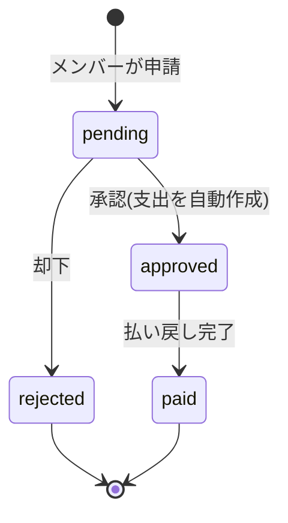

# 会計アプリ 引継ぎ資料

2026-09-22 · 作成者 @Someone

## このアプリは何か

大学生サークルの会計を回すためのWebアプリ。メンバーが立て替えた支出を申請し、管理者が承認して収支に反映するまでを1つでまかなう。

利用者は2種類ある。

| 利用者 | アクセス方法 | できること |
| --- | --- | --- |
| 一般メンバー | サークルごとの共有URL(ログイン不要) | 立替申請の投稿(支払者・件名・金額・レシート画像・メモ) |
| 管理者(代表・会計) | メールアドレスとパスワード(メール確認必須) | 立替の承認・却下・精算、収入と支出の登録、サマリー確認、設定変更 |

サークルがテナントの単位になる。現時点では1サークルにつき管理者1名で、招待機能はない。

主要な機能は一通り動く。課金だけが未実装で、サークル作成時に `subscriptions` を `active` で作る仮実装のまま止めてある。

本番は Cloudflare Workers 上で稼働中。同じWorkerがフロントエンドの静的ファイルも配信するので、画面とAPIは同一オリジンになる。

## 技術スタックとリポジトリ構成

pnpm workspace + turborepo のモノレポ。ルートで `pnpm <タスク名>` を叩くと turbo が各パッケージに配る。pnpm 9.0.0 / Node 18以上。

| パッケージ | 役割 | 主要技術 |
| --- | --- | --- |
| `apps/web` | フロントエンド | Vite 8 + React 19 + react-router-dom 7(HashRouter) + Tailwind CSS 4 + Tanstack Query 5 + shadcn ui |
| `apps/server` | バックエンド(Cloudflare Workers) | Hono 4 + better-auth 1.7.1 + drizzle-orm 0.45 + wrangler 4 |
| `packages/eslint-config` | 共通ESLint設定 | `base.js` と `react-internal.js` |
| `packages/typescript-config` | 共通tsconfig | `base.json` / `vite.json` / `workers.json` |

Cloudflare側のバインディングは `apps/server/wrangler.jsonc` にまとまっている。

| バインディング | リソース | 用途 |
| --- | --- | --- |
| `DB` | D1 `accounting-app-d1` | 全テーブル |
| `R2` | R2 `accounting-app-r2` | レシート画像 |
| `EMAIL` | Email Routing (send\_email) | 確認メールとパスワード再設定メール |
| `ASSETS` | Assets(`../web/dist`) | ビルド済みフロントの配信 |

サーバー側の中身は次のとおり。

- `src/index.ts` … Honoアプリ本体。全ルートをチェーンで繋ぎ `AppType` をexportする
- `src/routes/` … `signup.ts` / `circles.ts` / `reimbursements.ts`(公開) / `admin.ts`(管理者)
- `src/db/schema.ts` … アプリ側のテーブル定義。`db/auth-schema.ts` はbetter-authが生成するので手で触らない
- `src/auth.ts` … better-authの設定。`src/lib/receipt.ts` … 画像アップロードの共通処理

画面は `apps/web/src/routes/` に1ファイル1ページで並ぶ。`AdminLayout.tsx` が `/dashboard` 配下の共通シェルで、ナビゲーションとサークル情報の受け渡しを担う。Tailwindの設定ファイルはなく、`src/index.css` にCSSで直接書く(Tailwind v4の方式)。

## 開発環境の立ち上げ方

手順は4つ。手作業が必要なのは `.dev.vars` を作る工程だけ。

1. 依存を入れる。`pnpm install`
2. `apps/server/.dev.vars` を作る。`.dev.vars.example` をコピーし、`BETTER_AUTH_SECRET` を `node -e "console.log(require('crypto').randomBytes(32).toString('base64'))"` などで生成して埋める。`WEB_ORIGIN` と `BETTER_AUTH_URL` はexampleのlocalhostのままでよい
3. ローカルD1にマイグレーションを当てる。`pnpm --filter server db:apply-local`
4. 起動する。`pnpm dev` でフロントが localhost:3000、サーバーが localhost:8787

`.dev.vars` は必須。`wrangler.jsonc` の `vars` には本番URLが入っているので、ここでlocalhostに上書きしないとローカルのログインが通らない。

もう1つ、`wrangler.jsonc` の `account_id` を自分のAccount ID に埋めないと `pnpm dev` が起動しない。理由と回避策は「デプロイ手順」に書いた。

フロントの `VITE_API_URL` は `apps/web/.env.development` と `.env.production` がコミット済みなので、用意するものはない。

よく使うコマンドはこの辺り。

| コマンド | 内容 |
| --- | --- |
| `pnpm dev` | フロントとサーバーを同時起動 |
| `pnpm check-types` | 全パッケージの `tsc --noEmit` |
| `pnpm lint` | 全パッケージのESLint(警告0件が合格ライン) |
| `pnpm build` | 全パッケージのビルド |
| `pnpm --filter server db:generate` | スキーマ変更からマイグレーションSQLを生成 |
| `pnpm --filter server db:apply-local` | `drizzle/*.sql` を順にローカルD1へ適用 |

テストは1つもない。動作確認は手動か curl になる。

ローカルD1の実体は `apps/server/.wrangler/state/v3/d1/` にある(git管理外、`wrangler dev` 実行中はファイルロックされる)。ここを消すとデータもテーブルも全部消えるので、消してしまったら `db:apply-local` を再実行して会員登録し直す。

## 押さえておくべき仕組み

ここが一番ハマりやすい。いずれも実際に踏んだもので、経緯を含めた詳細は `CLAUDE.md` に書いてある。着手前に一読してほしい。

**型の共有**。`apps/server` のルートを変えたら `pnpm --filter server build` を先に流す。`apps/web` はサーバーのソースではなくビルド済みの `dist/index.d.ts` を読む作りなので、ビルドしないとフロントの型が古いままになる。`src/index.ts` のルートは1本のチェーンで繋ぐ必要があり、途中で変数に代入し直すと型推論が消える。

**認証**。`src/auth.ts` の `createAuth(env)` はリクエストごとに呼ぶファクトリ。Workersはバインディングをリクエスト単位でしか渡さないので、シングルトンにできない。スキーマ再生成は `auth` パッケージ(1.7.1)で行う。古い `@better-auth/cli` は列が欠けたスキーマを吐き、会員登録が500になる。

**会員登録**。`POST /api/signup` がユーザーとサークルを同時に作る。登録済みメールで叩かれたとき、better-authはわざと成功を返す。登録済みかどうかを外から判別させないための仕様なので、ここをエラーに「直す」とメールアドレスの存在が漏れる。パスワード再設定も同じ理由で、未登録でも同じ画面を返す。

**JSONのPOST/PATCH**。必ず `zValidator("json", schema)` を使う。パスパラメータ付きのルートで生の `c.req.json()` を使うと、RPCクライアント側の型から `json` が消えてコンパイルが通らなくなる。

**画像アップロード**。`multipart/form-data` のルートはRPCの入力型が付かないので、フロントからは素の `fetch` で叩く。このとき `credentials: "include"` を必ず付ける。付けないとセッションcookieが飛ばず401になる。サイズ上限とMIME判定は `src/lib/receipt.ts` に集約してあるので、新しいアップロード口もここを通す。

**マイグレーション**。`wrangler d1 migrations apply` は使えない(drizzle-kitの出力形式と非互換)。`wrangler d1 execute ... --file=...` で1ファイルずつ当てる。列を増やすときは `.notNull()` 単体ではなく `.notNull().default("")` にする。既存行があるとNOT NULLで失敗するため。なお、drizzleの `enum` に値を足すだけならマイグレーションは不要(SQLite側はただのTEXT)。

**複数文の書き込み**。`db.transaction()` ではなく `db.batch()` を使う。D1のドライバは型の上では両方受けるが、実際に使えるのは `batch` のほう。

**ルーティング**。フロントは `HashRouter`。メールに入れるリンクを組み立てるときは `#` を必ず入れる(`${WEB_ORIGIN}/#/login?verified=1`)。入れないと画面に到達しない。

**その他**。CORSは `env.WEB_ORIGIN` を返す関数形式で書く必要がある(`credentials: true` と `*` は併用できない)。`wrangler.jsonc` の `compatibility_date` は、入っている workerd のバージョン日付を超えてはいけない。

## データモデル

D1に13テーブル。うち4つ(`user` `session` `account` `verification`)はbetter-authが管理し、`src/db/auth-schema.ts` に自動生成される。残りがアプリ固有のテーブル。

| テーブル | 内容 | 状態 |
| --- | --- | --- |
| `circles` | サークル。共有URL用の `public_token` を持つ | 使用中 |
| `circle_members` | 管理者とサークルの紐付け | 使用中(representativeのみ) |
| `reimbursement_requests` | 立替申請 | 使用中 |
| `income_records` | 収入 | 使用中 |
| `expense_records` | 支出。手動入力と立替承認由来の2種類 | 使用中 |
| `subscriptions` | サブスク契約。サークル作成時に active で作る | 仮実装 |
| `virtual_accounts` | GMOあおぞらの仮想口座 | 未使用 |
| `subscription_payments` | サブスク決済履歴 | 未使用 |
| `bank_transfer_deposits` | 入金通知ログ | 未使用 |

末尾の3つは課金を見越して定義だけしてある。コードからは一度も読み書きしていない。

立替申請のステータスは4つ。支出への計上は承認の時点で起きる。



承認すると `expense_records` に `source: "reimbursement"` の行が1件作られる。この行は削除できない。手動入力分と区別する唯一の目印がこの `source` なので、別のフラグを足さないこと。`paid` はステータスを進めるだけで、金額の二重計上は起きない。

画像の持ち方は3つのテーブルで異なる。

- 立替申請 … 必須
- 支出(手動入力) … 任意。立替由来の行は常にnull
- 収入 … 列は残っているが使わない。以前は収入側にあった機能を支出へ移した名残りで、列を消すとテーブル再構築が走るため意図的に残してある

R2のキーは `receipts/{circleId}/{uuid}.{拡張子}`。画像はURLを直接公開せず、Worker経由でセッション確認を通してから返す。

## デプロイ手順

引き継いだ直後はデプロイできない。前任者のアカウント固有の値は全部抜いてあり、`TODO_` で始まるプレースホルダーが入っている。自分のCloudflareアカウントの値に差し替えるところから始める。

まずCloudflare側のリソースを作る。

```sh
pnpm dlx wrangler login
pnpm dlx wrangler d1 create accounting-app-d1     # 出力される database_id を控える
pnpm dlx wrangler r2 bucket create accounting-app-r2
```

送信元に使うドメインをCloudflareのEmail Routingに登録し、検証を済ませておく。検証していないドメインだと、確認メールの送信が `E_SENDER_NOT_VERIFIED` で失敗する。

そのうえで、次の5つを差し替える。

| ファイル | 項目 | 入れる値 |
| --- | --- | --- |
| `apps/server/wrangler.jsonc` | `account_id` | `wrangler whoami` に出るAccount ID |
| `apps/server/wrangler.jsonc` | `d1_databases[0].database_id` | `wrangler d1 create` の出力 |
| `apps/server/wrangler.jsonc` | `vars.WEB_ORIGIN` / `vars.BETTER_AUTH_URL` | 自分のWorkerのURL |
| `apps/server/wrangler.jsonc` | `vars.EMAIL_FROM_ADDRESS` | 検証済みドメインの送信元アドレス |
| `apps/web/.env.production` | `VITE_API_URL` | `WEB_ORIGIN` と同じURL |

`account_id` は本番だけでなく**ローカル開発にも必要**。`send_email` が `remote: true` なので、`wrangler dev` は起動時にCloudflareへ接続を張りにいく。TODOのままだと `Failed to start the remote proxy session` で起動しない。メール機能なしでとりあえず動かしたいなら、`send_email` を `remote: false` にすれば起動できる。

WorkerのURLは初回デプロイまで確定しない。一度デプロイして払い出されたURLを確認し、上の表に反映してもう一度デプロイする。

シークレットは `BETTER_AUTH_SECRET` の1つだけ。`wrangler secret put BETTER_AUTH_SECRET` で登録する。これはリポジトリには入らない。

デプロイ自体はルートで `pnpm run deploy` を叩くだけ。turbo がフロントのビルドを済ませてから `wrangler deploy` を走らせる。順番が大事で、Workerが `../web/dist` をそのまま配信するので、フロントが古いと古い画面が公開される。デプロイ前に `pnpm check-types` と `pnpm lint` を通しておく。`wrangler deploy` は型エラーを見ない。

データベースの変更は自動で適用されない。`apps/server/drizzle/` のSQLを番号順に1ファイルずつ当てる。

```sh
pnpm dlx wrangler d1 execute accounting-app-d1 --remote --file=apps/server/drizzle/0000_heavy_fantastic_four.sql
```

適用済みかを記録する仕組みはないので、どこまで当てたかは自分で管理する。新しいアカウントで一から作る場合は `0000` から順に全部当てる。

## 実装済みの機能と未実装の機能

会計を回す一通りは動く。残っているのは課金と、成果物を外に出す機能。

| 機能 | 状態 | 備考 |
| --- | --- | --- |
| 会員登録(メール確認付き) | 実装済み | ユーザーとサークルを同時に作る |
| ログイン / パスワード再設定 | 実装済み | better-authの標準エンドポイントを利用 |
| 共有URLの発行 | 実装済み | `/dashboard/publicToken` |
| 立替申請(一般メンバー) | 実装済み | ログイン不要。画像必須 |
| 立替の承認・却下 | 実装済み | 承認時に支出を自動生成 |
| 未精算一覧・精算済みにする | 実装済み | `/dashboard/liquidation` |
| 収入登録 | 実装済み | 画像なし |
| 支出登録 | 実装済み | 画像は任意で添付可 |
| 収支一覧(検索・並べ替え) | 実装済み | `/dashboard/transactions` |
| サマリー(総収入・総支出・収支) | 実装済み | 期間指定はなく全期間の合計のみ |
| 設定(会員情報・メール・パスワード変更) | 実装済み | メールとパスワードはbetter-auth側に任せている |
| サブスク管理 | 画面のみ | 入力フォームはあるが決済に繋がっていない |
| 課金(Square / GMO仮想口座) | 未実装 | サブスクは常に `active` の仮実装 |
| 会計出力(大学書式) | 未実装 | ダッシュボードにボタンだけある |
| 大学別書式フォーマット登録 | 未実装 | 同上 |
| CSV / PDF エクスポート | 未実装 | 意図的に後回し |
| 通知 | 未実装 | 設定画面のスイッチはdisabled |
| 管理者の招待・複数管理者 | 未実装 | テーブルは複数対応だが、1名しか作らない |
| 紹介ページ | 仮置き | 掛ける文言は未確定 |

未実装のものはどれも意図的に後回しにしたもので、やり忘れではない。要件の背景は `note/方針.md` を見ると早い。

## 残っている課題と注意点

引き継ぎ時点で `pnpm lint` が失敗する。未使用変数の警告が3件あり、このリポジトリは `--max-warnings 0` なので警告でも落ちる。いずれも作業途中の名残りで、機能には影響しない。

| ファイル | 警告 |
| --- | --- |
| `components/Header.tsx` | `menuIcon` が未使用 |
| `routes/DashboardSummaryPage.tsx` | `unpaidCount` が未使用 |
| `routes/SubscriptionAdminPage.tsx` | `OptionalBadge` が未使用 |

ほかに残っているもの。

- **CLAUDE.md に2箇所ずれあり**。ルーターを `BrowserRouter` と書いているが実際は `HashRouter`。また参照先の `note/要件.md` は存在しない
- **使っていない依存**。`react-router` v8 が入っているが、コードは全部 `react-router-dom` からimportしている

下の箇所は、一見不自然だが意図してそうなっている。「直したくなる」形をしているので注意してほしい。

| 箇所 | 直してはいけない理由 |
| --- | --- |
| `signup.ts` の重複メール処理 | エラーを返すと、登録済みメールアドレスを外部から特定できてしまう |
| パスワード再設定リンクの自前組み立て | better-authが返すURLだと、HashRouterでトークンを拾えない |
| `income_records.receipt_image_key` | スキーマから消すとテーブル再構築が走り、旧データの画像がR2に取り残される |
| `expense_records.source` | 立替由来と手動入力を分ける唯一の目印 |
| `src/db/auth-schema.ts` | better-authの生成物。手で編集せず再生成する |

前任者の本番データは引き継がれない。自分のCloudflareアカウントでD1とR2を作り直すところから始まる。その後は自分の本番に実データが入っていくので、`--remote` 付きのコマンドは実行前に内容を確かめること。動作確認はローカルD1で十分にできる。

## 次に着手するとよいこと

優先順に並べると次のとおり。上の2つはすぐ終わる。

1. **lint を通す**。未使用変数3件を消すだけ。CIを入れるにしても、まずここが緑でないと始まらない
2. **README.md を直す**。中身が実態と合っていない
3. **期間指定の集計**。今のサマリーは全期間の合計しか出せない。年度や月で絞れるようにする
4. **会計出力**。`note/方針.md` が掲げる最終目標が「一定の形で収支を出力する」なので、これが入って初めてアプリとして完結する。3が前提になる
5. **課金の実装**。リリースするなら必須。テーブルは用意済みで、Square と GMOあおぞらの仮想口座を想定している
6. **テストの追加**。今は1件もない。特に立替の承認(支出が自動生成される部分)は壊れても気づきにくいので、ここだけでも欲しい

3から5の順番は迷ったが、リリース前に価値が出るのは会計出力だと考えて会計出力を先に置いた。課金を先にする判断もありうる。
